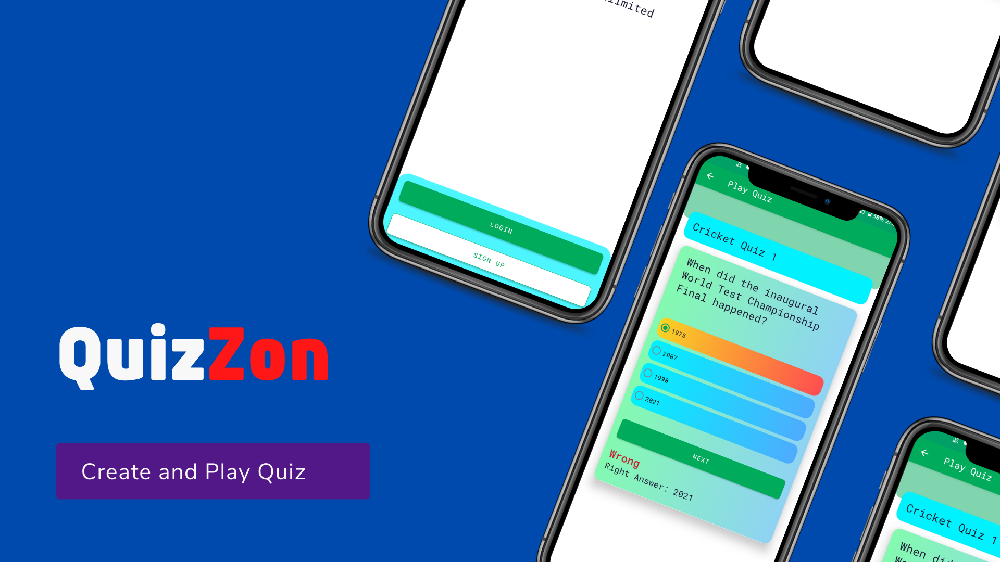

# **QuizZon**

**QuizZon** is an app to create and play quizzes

# Application Install

***You can Install QuizZon app from playstore 👇***

## Setup
Clone the repository on your machine. Open the project on your IDE and connect it to firebase and harperDB and everything will be setup

- Add your firebase json class in app directory
- Add your Harperdb Credentital in build.property

## About

 It uses firebase and HarperDB as it's backend. It uses Firebase Authentication for email based auth, Firebase Crashlytics for crash reporting and HarperDB as its database.

- Fully functionable.
- Clean and Simple Material UI.

### Insights into the app 🔎

## 📸 Screenshots

||||
|:----------------------------------------:|:-----------------------------------------:|:-----------------------------------------: |
| 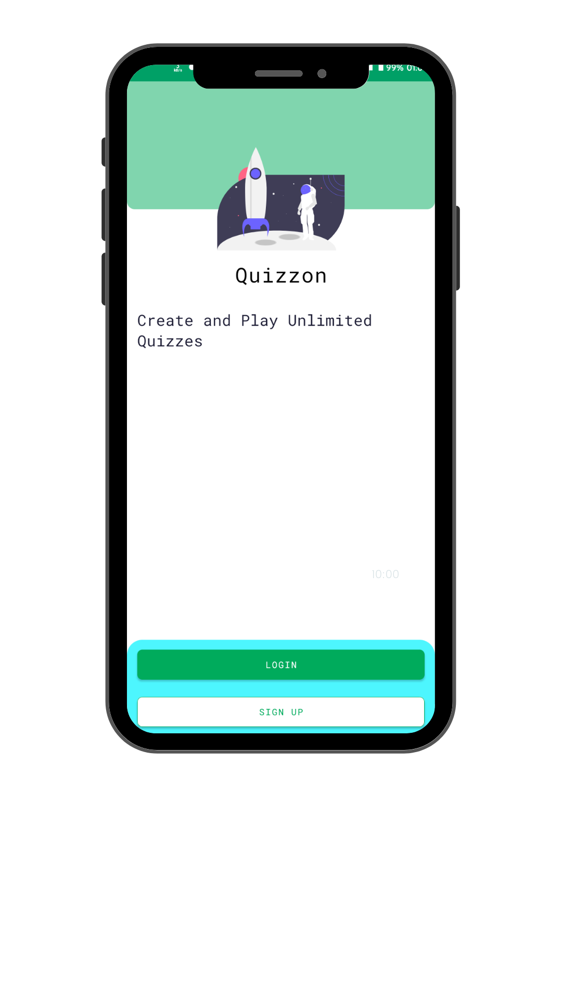 | 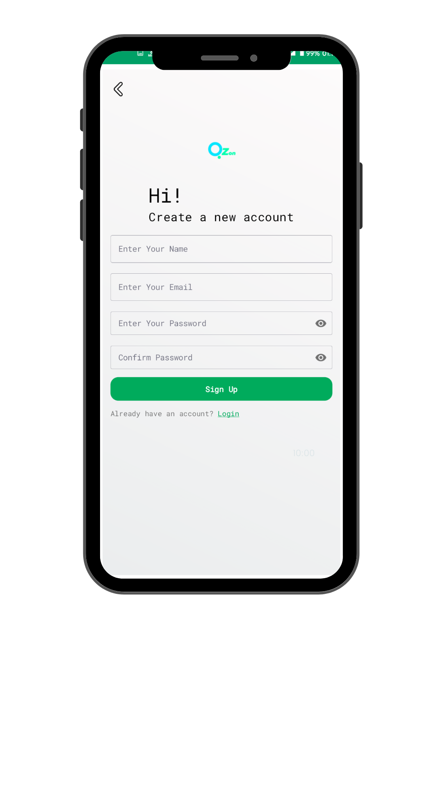 | 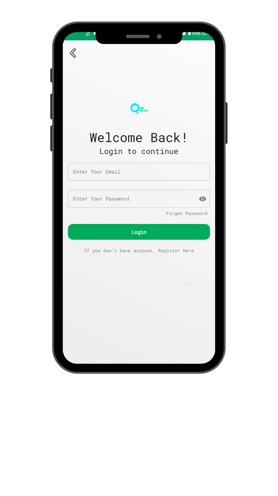 |
| 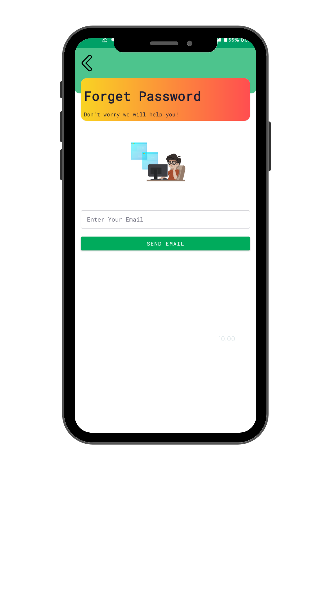  | 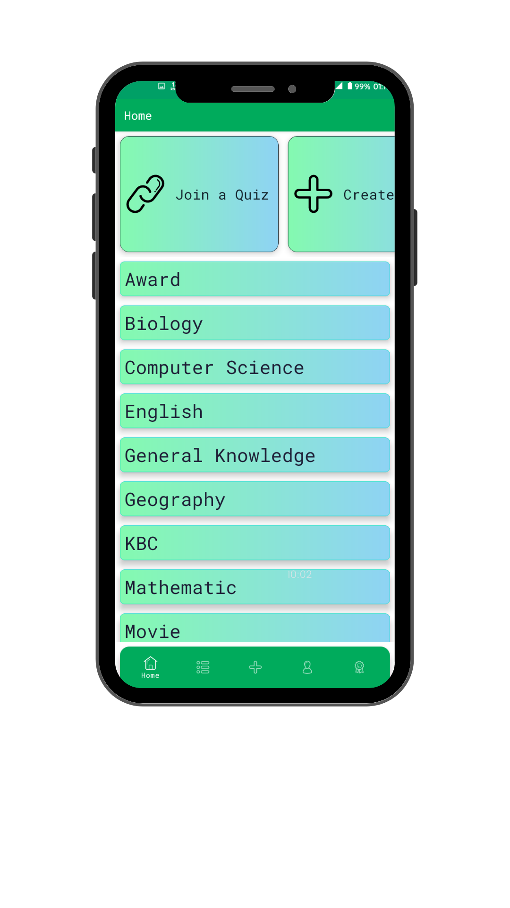 | 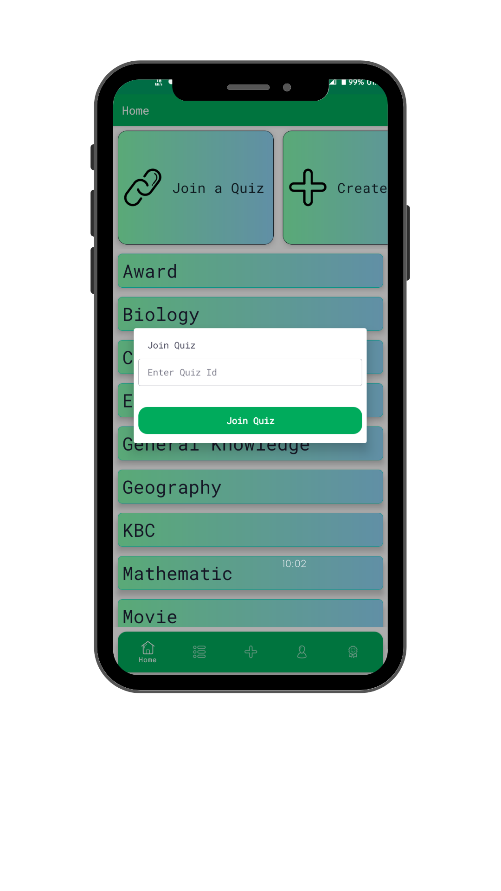    |
| 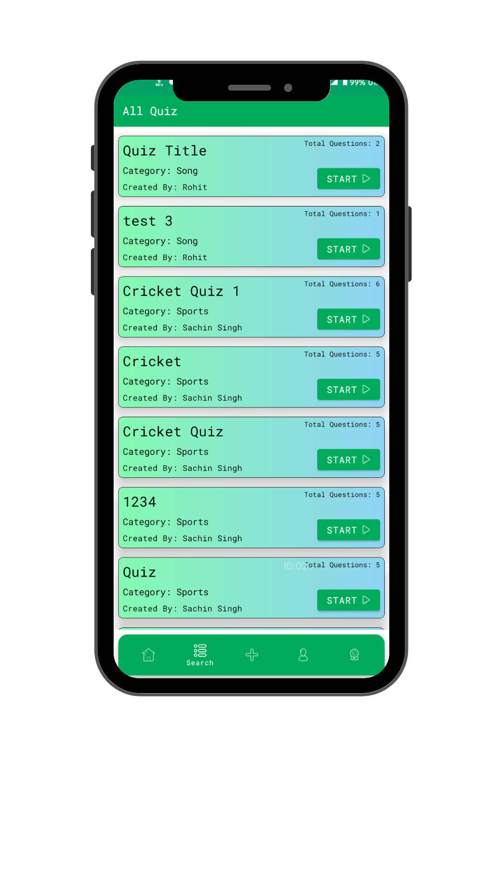 | 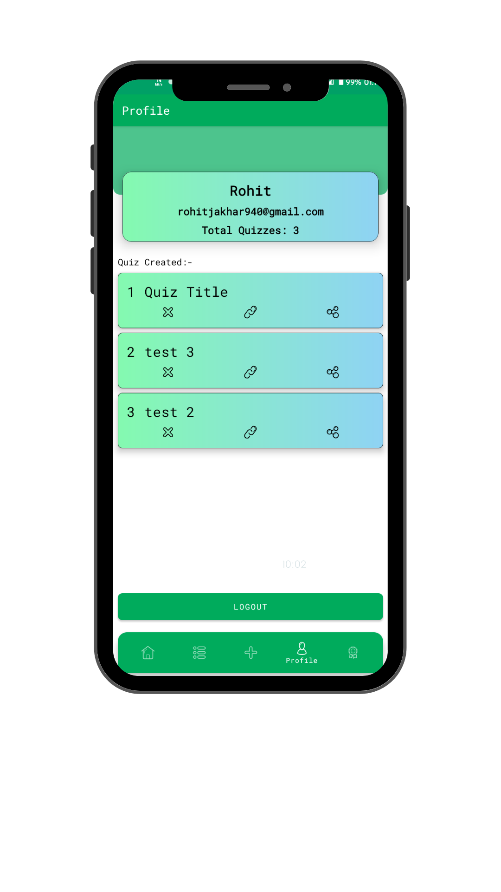    | 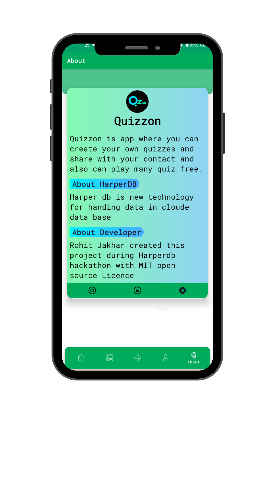      |
|  |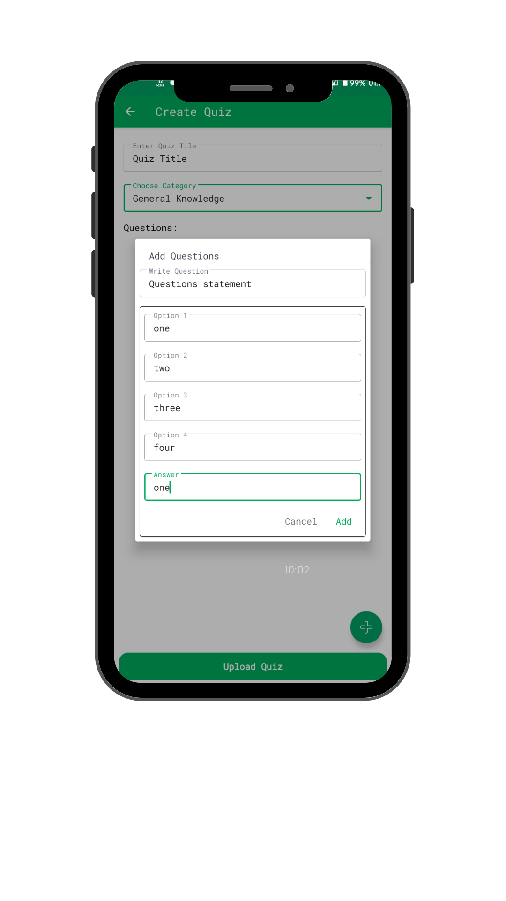  |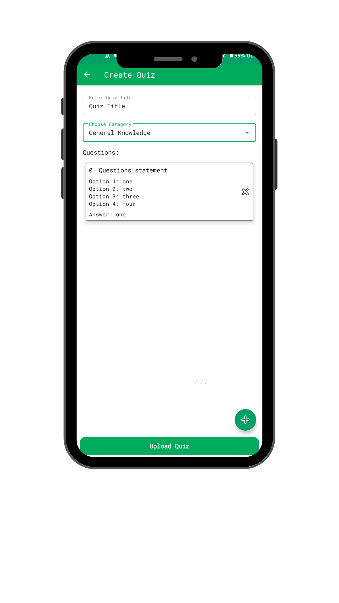      |
|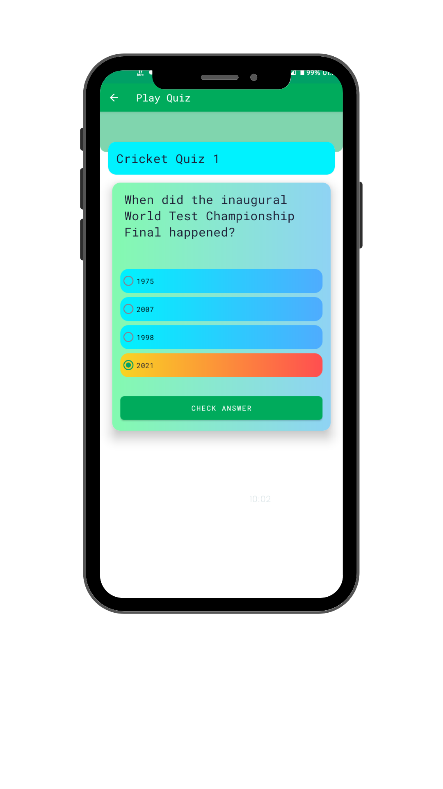  |  |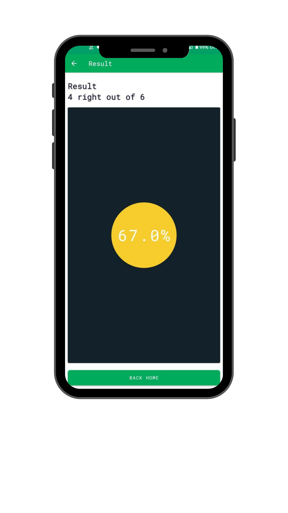      |

## Built With 🛠
- [Kotlin](https://kotlinlang.org/) - First class and official programming language for Android development.
- [Coroutines](https://kotlinlang.org/docs/reference/coroutines-overview.html) - For asynchronous and more..
- [Flow](https://kotlin.github.io/kotlinx.coroutines/kotlinx-coroutines-core/kotlinx.coroutines.flow/-flow/) - A cold asynchronous data stream that sequentially emits values and completes normally or with an exception.
 - [StateFlow](https://developer.android.com/kotlin/flow/stateflow-and-sharedflow) - StateFlow is a state-holder observable flow that emits the current and new state updates to its collectors.
- [Android Architecture Components](https://developer.android.com/topic/libraries/architecture) - Collection of libraries that help you design robust, testable, and maintainable apps.
  - [ViewModel](https://developer.android.com/topic/libraries/architecture/viewmodel) - Stores UI-related data that isn't destroyed on UI changes.
  - [ViewBinding](https://developer.android.com/topic/libraries/view-binding) - Generates a binding class for each XML layout file present in that module and allows you to more easily write code that interacts with views.
  - [DataStore](https://developer.android.com/topic/libraries/architecture/datastore) - Jetpack DataStore is a data storage solution that allows you to store key-value pairs or typed objects with protocol buffers.
- [Dependency Injection](https://developer.android.com/training/dependency-injection) -
  - [Hilt-Dagger](https://dagger.dev/hilt/) - Standard library to incorporate Dagger dependency injection into an Android application.
  - [Hilt-ViewModel](https://developer.android.com/training/dependency-injection/hilt-jetpack) - DI for injecting `ViewModel`.
- Backend
  - [Firebase](https://firebase.google.com)
    - Firebase Auth - To support email based authentication and google authentication
    - Firebase Crashlytics - To report app crashes
  - [HarperDB](https://harperdb.io) -  HarperDB is a geo-distributed database with hybrid SQL & NoSQL functionality in one powerful tool, accessed via a REST API.
- [Retrofit](https://square.github.io/retrofit/) - A type-safe HTTP client for Android and Java.
- [GSON](https://github.com/google/gson) - A modern JSON library for Kotlin and Java.
- [GSON Converter](https://github.com/square/retrofit/tree/master/retrofit-converters/gson) - A Converter which uses Moshi for serialization to and from JSON.
- [Material Components for Android](https://github.com/material-components/material-components-android) - Modular and customizable Material Design UI components for Android.
- [Progress Button](https://github.com/hellosagar/ProgressButton) - Progress Button is a android library for hanling different types state like active, finished, enabled, disabled and reset with a single line of code.

# Package Structure

    com.rohit.Quizzon    # Root Package
    .
    ├── data                # For data handling.
    |   ├── local           # Room DB and its related classes
    |   ├── remote          # Firebase, HarperDB and their relative classes
    │   ├── model           # Model data classes, both remote and local entities
    │
    |
    ├── di                  # Dependency Injection
    │   └── module          # DI Modules
    |
    ├── ui                  # UI/View layer
    |   ├── adapters        # All Adapters and Diffutils
    │   ├── fragments       # All Fragments
    │   ├── activity        # Containing All Activities
    |   ├── viewmodels      # Viewmodel classes
    |   ├── viewholders     # All Viewholders for adapter
    │
    |
    ├── Splash Screen       # Splash Screen for checking user state
    |
    └── utils               # Utility Classes / Kotlin extensions

## Architecture
This app uses [***MVVM (Model View View-Model)***](https://developer.android.com/jetpack/docs/guide#recommended-app-arch) architecture.

## Contribute 🤝

If you want to contribute to this library, you're always welcome!

## Contact 📩

Have an project? DM us at 👇 

## Donation 💰

If this project help you reduce time to develop, you can give me a cup of coffee :)

 
